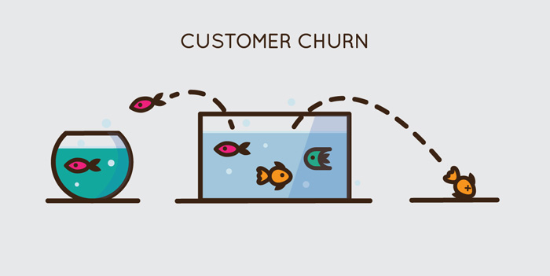
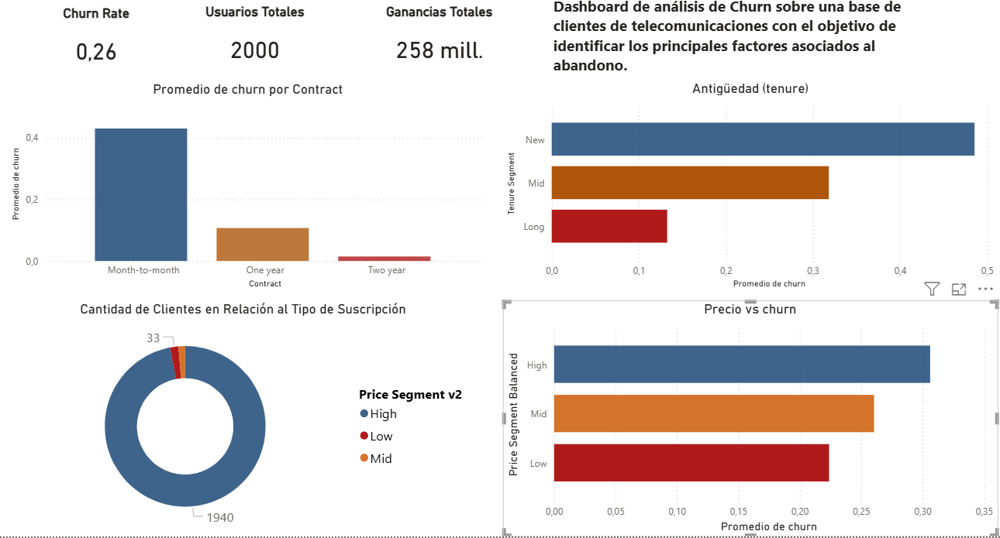
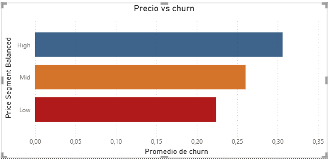
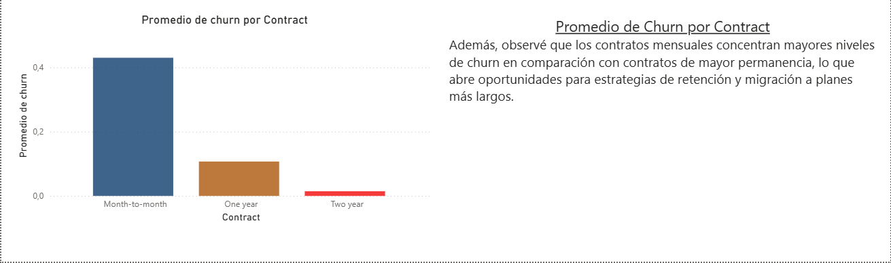

# Customer Churn Analysis & Retention Dashboard
 

 

## 📌 Project Overview

This project focuses on analyzing customer churn behavior in a telecommunications dataset.

The objective was to identify the main drivers behind customer attrition and transform raw data into actionable business insights.

This is an end-to-end Business Intelligence project covering:

* SQL data modeling
* KPI creation
* customer segmentation
* Power BI dashboard development
* executive storytelling

---

## 🛠 Tools Used

* SQL (MySQL)
* Power BI
* DAX
* CSV data processing
* Business Intelligence storytelling

---

## 🎯 Business Objective

Reduce customer churn by identifying high-risk customer segments and understanding the impact of:

* pricing
* contract type
* customer tenure

---

## 📊 Key Insights

* Customers in the **mid-price segment** show the highest churn rate (~49%)
* Monthly contracts present the highest risk of attrition
* Most customers are concentrated in higher monthly charges plans
* Tenure strongly influences customer retention

---

## 💡 Business Recommendation

Focus retention campaigns on:

* mid-tier customers
* short-term contract users
* customers with low tenure

### Potential actions:

* loyalty discounts
* migration to yearly plans
* customer success campaigns

 

## 📷 Dashboard Preview
 

  
 

 

 

## 🚀 Outcome

This project demonstrates the full BI workflow from raw data ingestion to executive decision-making insights.
